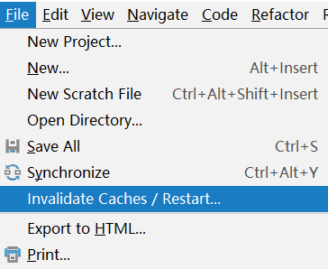
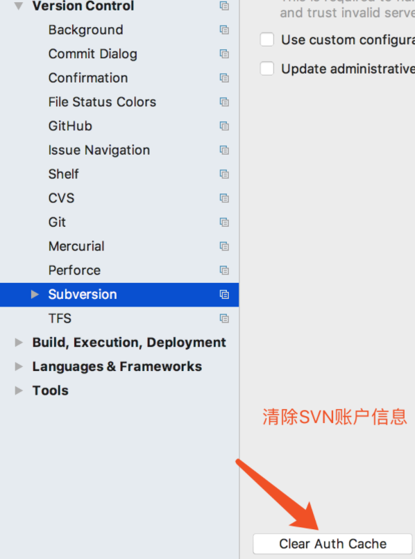
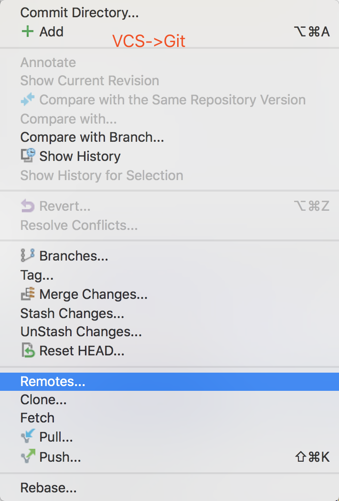
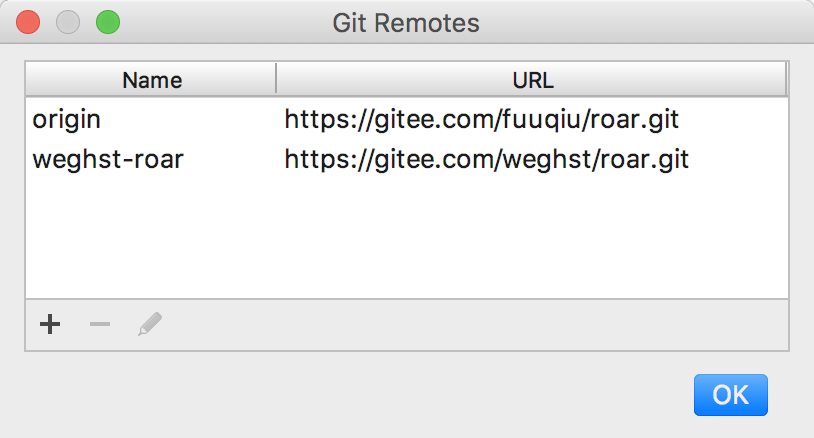
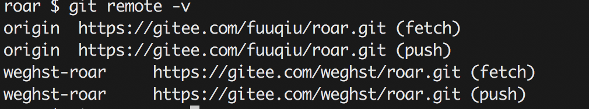

### IDEA开发工具

#### 常用配置

#### 文件搜索不准确

​	清除缓存，即可恢复正常



#### 清除SVN用户信息 



#### 快捷键

- 指定方法被调用查看:option+F7
- 代码格式化:comd+option+L
- 查看变量注释:mac ctrl+J
- 打开一个UML视图:⌥⇧⌘U
- 弹出一个UML窗口:⌥⌘U 
- 去除多余无用的包:Ctrl+Alt+O

```java
/**快捷键整理
 * 快速定位实现类:cmd+alt+B //多个实现子类,显示向下的实现视图关系
 * 对象快速生成模板:Cmd+Alt+v
 * 继承关系图:cmd+alt+u
 * 调用关系图:ctr+alt+H
 * 方法或类成员变量的调用树:alt+con+H
 * 导包自动删除未使用的包:ctr+alt+O
 */
```


#### 


## Git使用

### Fork项目

- ##### 新建Remote数据源





##### 查看命令:

```
git remote -v
```




## 注册

### 

### key

```
K71U8DBPNE-eyJsaWNlbnNlSWQiOiJLNzFVOERCUE5FIiwibGljZW5zZWVOYW1lIjoibGFuIHl1IiwiYXNzaWduZWVOYW1lIjoiIiwiYXNzaWduZWVFbWFpbCI6IiIsImxpY2Vuc2VSZXN0cmljdGlvbiI6IkZvciBlZHVjYXRpb25hbCB1c2Ugb25seSIsImNoZWNrQ29uY3VycmVudFVzZSI6ZmFsc2UsInByb2R1Y3RzIjpbeyJjb2RlIjoiSUkiLCJwYWlkVXBUbyI6IjIwMTktMDUtMDQifSx7ImNvZGUiOiJSUzAiLCJwYWlkVXBUbyI6IjIwMTktMDUtMDQifSx7ImNvZGUiOiJXUyIsInBhaWRVcFRvIjoiMjAxOS0wNS0wNCJ9LHsiY29kZSI6IlJEIiwicGFpZFVwVG8iOiIyMDE5LTA1LTA0In0seyJjb2RlIjoiUkMiLCJwYWlkVXBUbyI6IjIwMTktMDUtMDQifSx7ImNvZGUiOiJEQyIsInBhaWRVcFRvIjoiMjAxOS0wNS0wNCJ9LHsiY29kZSI6IkRCIiwicGFpZFVwVG8iOiIyMDE5LTA1LTA0In0seyJjb2RlIjoiUk0iLCJwYWlkVXBUbyI6IjIwMTktMDUtMDQifSx7ImNvZGUiOiJETSIsInBhaWRVcFRvIjoiMjAxOS0wNS0wNCJ9LHsiY29kZSI6IkFDIiwicGFpZFVwVG8iOiIyMDE5LTA1LTA0In0seyJjb2RlIjoiRFBOIiwicGFpZFVwVG8iOiIyMDE5LTA1LTA0In0seyJjb2RlIjoiR08iLCJwYWlkVXBUbyI6IjIwMTktMDUtMDQifSx7ImNvZGUiOiJQUyIsInBhaWRVcFRvIjoiMjAxOS0wNS0wNCJ9LHsiY29kZSI6IkNMIiwicGFpZFVwVG8iOiIyMDE5LTA1LTA0In0seyJjb2RlIjoiUEMiLCJwYWlkVXBUbyI6IjIwMTktMDUtMDQifSx7ImNvZGUiOiJSU1UiLCJwYWlkVXBUbyI6IjIwMTktMDUtMDQifV0sImhhc2giOiI4OTA4Mjg5LzAiLCJncmFjZVBlcmlvZERheXMiOjAsImF1dG9Qcm9sb25nYXRlZCI6ZmFsc2UsImlzQXV0b1Byb2xvbmdhdGVkIjpmYWxzZX0=-Owt3/+LdCpedvF0eQ8635yYt0+ZLtCfIHOKzSrx5hBtbKGYRPFDrdgQAK6lJjexl2emLBcUq729K1+ukY9Js0nx1NH09l9Rw4c7k9wUksLl6RWx7Hcdcma1AHolfSp79NynSMZzQQLFohNyjD+dXfXM5GYd2OTHya0zYjTNMmAJuuRsapJMP9F1z7UTpMpLMxS/JaCWdyX6qIs+funJdPF7bjzYAQBvtbz+6SANBgN36gG1B2xHhccTn6WE8vagwwSNuM70egpahcTktoHxI7uS1JGN9gKAr6nbp+8DbFz3a2wd+XoF3nSJb/d2f/6zJR8yJF8AOyb30kwg3zf5cWw==-MIIEPjCCAiagAwIBAgIBBTANBgkqhkiG9w0BAQsFADAYMRYwFAYDVQQDDA1KZXRQcm9maWxlIENBMB4XDTE1MTEwMjA4MjE0OFoXDTE4MTEwMTA4MjE0OFowETEPMA0GA1UEAwwGcHJvZDN5MIIBIjANBgkqhkiG9w0BAQEFAAOCAQ8AMIIBCgKCAQEAxcQkq+zdxlR2mmRYBPzGbUNdMN6OaXiXzxIWtMEkrJMO/5oUfQJbLLuMSMK0QHFmaI37WShyxZcfRCidwXjot4zmNBKnlyHodDij/78TmVqFl8nOeD5+07B8VEaIu7c3E1N+e1doC6wht4I4+IEmtsPAdoaj5WCQVQbrI8KeT8M9VcBIWX7fD0fhexfg3ZRt0xqwMcXGNp3DdJHiO0rCdU+Itv7EmtnSVq9jBG1usMSFvMowR25mju2JcPFp1+I4ZI+FqgR8gyG8oiNDyNEoAbsR3lOpI7grUYSvkB/xVy/VoklPCK2h0f0GJxFjnye8NT1PAywoyl7RmiAVRE/EKwIDAQABo4GZMIGWMAkGA1UdEwQCMAAwHQYDVR0OBBYEFGEpG9oZGcfLMGNBkY7SgHiMGgTcMEgGA1UdIwRBMD+AFKOetkhnQhI2Qb1t4Lm0oFKLl/GzoRykGjAYMRYwFAYDVQQDDA1KZXRQcm9maWxlIENBggkA0myxg7KDeeEwEwYDVR0lBAwwCgYIKwYBBQUHAwEwCwYDVR0PBAQDAgWgMA0GCSqGSIb3DQEBCwUAA4ICAQC9WZuYgQedSuOc5TOUSrRigMw4/+wuC5EtZBfvdl4HT/8vzMW/oUlIP4YCvA0XKyBaCJ2iX+ZCDKoPfiYXiaSiH+HxAPV6J79vvouxKrWg2XV6ShFtPLP+0gPdGq3x9R3+kJbmAm8w+FOdlWqAfJrLvpzMGNeDU14YGXiZ9bVzmIQbwrBA+c/F4tlK/DV07dsNExihqFoibnqDiVNTGombaU2dDup2gwKdL81ua8EIcGNExHe82kjF4zwfadHk3bQVvbfdAwxcDy4xBjs3L4raPLU3yenSzr/OEur1+jfOxnQSmEcMXKXgrAQ9U55gwjcOFKrgOxEdek/Sk1VfOjvS+nuM4eyEruFMfaZHzoQiuw4IqgGc45ohFH0UUyjYcuFxxDSU9lMCv8qdHKm+wnPRb0l9l5vXsCBDuhAGYD6ss+Ga+aDY6f/qXZuUCEUOH3QUNbbCUlviSz6+GiRnt1kA9N2Qachl+2yBfaqUqr8h7Z2gsx5LcIf5kYNsqJ0GavXTVyWh7PYiKX4bs354ZQLUwwa/cG++2+wNWP+HtBhVxMRNTdVhSm38AknZlD+PTAsWGu9GyLmhti2EnVwGybSD2Dxmhxk3IPCkhKAK+pl0eWYGZWG3tJ9mZ7SowcXLWDFAk0lRJnKGFMTggrWjV8GYpw5bq23VmIqqDLgkNzuoog==
```


注册码有效期为2018年5月5日至2019年5月4日 使用前请将“0.0.0.0 [account.jetbrains.com](http://account.jetbrains.com/)”添加到hosts文件中