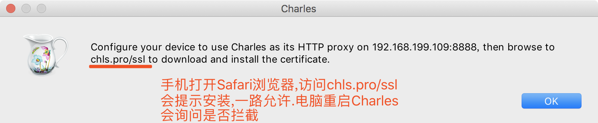

# Charles抓包工具


```
最近换了工作,换了城市.几乎除了我没换其他的都换了.又是一段新的生活开始...
```


## 简介

Charles是一个HTTP代理服务器,HTTP监视器,反转代理服务器，当浏览器连接Charles的代理访问互联网时，Charles可以监控浏览器发送和接收的所有数据。它允许一个开发者查看所有连接互联网的HTTP通信，这些包括request, response和HTTP headers （包含cookies与caching信息）。

## 下载地址

```
Charles下载：http://www.macbl.com/app/internet/charles
```
## 配置

### 开启http代理


### 设置代理


### 查看IP地址


### 安装电脑端证书


#### 证书安装


### 手机端配置


###  手机证书安装


### 查看手机安装证书路径



 

 