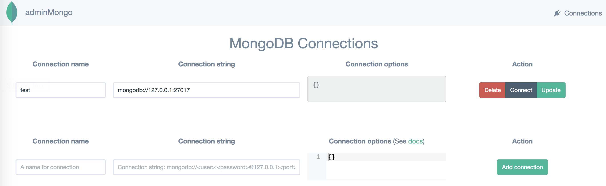
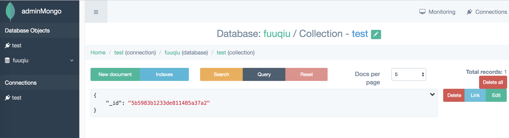

# AdminMongo可视化管理工具

**github地址**：<https://github.com/mrvautin/adminMongo>

### 安装方法：

#### 1、把git仓库克隆到本地

```
git clone https://github.com/mrvautin/adminMongo
```

#### 2、进入仓库

```
cd adminMongo
```

#### 3、安装

```
npm install
```

#### 4、启动

```
npm start
```

#### 5、访问地址 [http://127.0.0.1:1234](http://127.0.0.1:1234/) 

进来之后只需填写数据库名称*Connection name*，和本地ip地址 mongodb://127.0.0.1:27017 即可，点击**connect**进入即可




进入后台效果图

