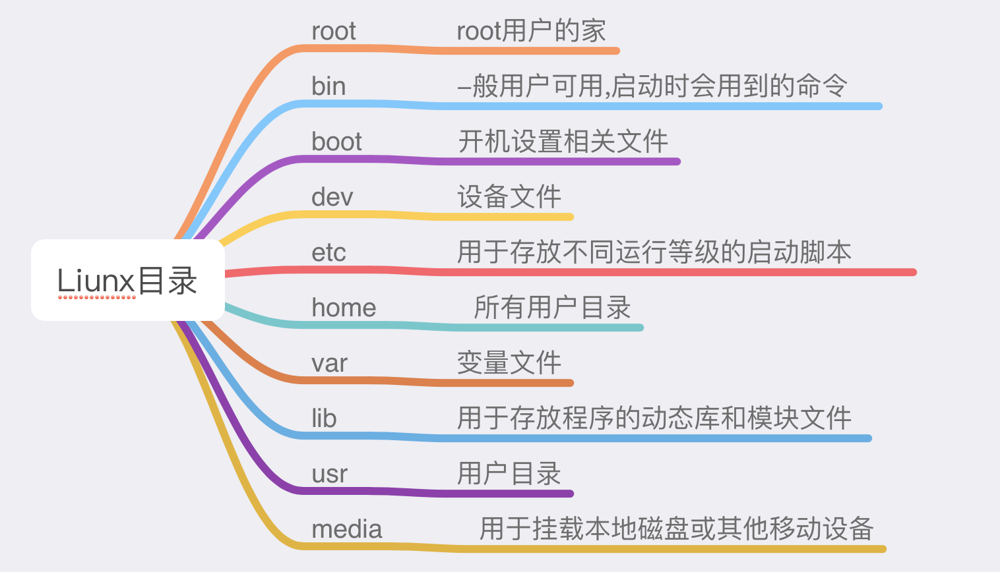

# CentOS系统

## 防火墙的基本操作命令：

```Shell
查询防火墙状态:
$ service   iptables status
#停止防火墙:
$ service   iptables stop 
#启动防火墙:
$ service   iptables start 
#重启防火墙:
$ service   iptables restart
#永久关闭防火墙:
$ chkconfig   iptables off
#永久关闭后启用:
$ chkconfig   iptables on
```


## linux目录介绍




## SSH免密登录:

vim /etc/ssh/sshd_config

```shell
prot 22  # ssh端口
PermitRootLogin yes  #允许Root登录
PubkeyAuthentication yes   #秘钥登录
PasswordAuthentication yes #密码登录
# 配置完成以后重启SSH服务 
service sshd restart 
cd /root/.ssh #配置允许登录公钥列表
vim authorized_keys  #加入本机 /Users/apple/.ssh id_rsa.pub 一行一个秘钥 检查头部 SSH
```


## Gogs Git服务安装

安装docker

```Shell
$ sudo yum install docker
```

启动并加入开机启动

```Shell
$ sudo systemctl start docker 
$ sudo systemctl enable docker
```

拉取Github

```Shell
 $ docker pull gogs/gogs
```

启动gogs 浏览器访问:http://ip:8081

```Shell
docker run --name=gogs -p 10022:22 -p 8081:3000 -v /home/gogs:/data gogs/gogs
```

Dock 官方手册

```Shell
# Pull image from Docker Hub.
$ docker pull gogs/gogs

# Create local directory for volume.
$ mkdir -p /var/gogs

# Use `docker run` for the first time.
$ docker run --name=gogs -p 10022:22 -p 10080:3000 -v /var/gogs:/data gogs/gogs

# Use `docker start` if you have stopped it.
$ docker start gogs
```


## Github新建仓库发布

```Shell
echo "# test" >> README.md
git init
git add README.md
git commit -m "first commit"
git remote add origin https://github.com/fuuqiu/test.git
git push -u origin master
```


## SVN服务安装

#### 1.安装svn

```Shell
$ yum -y install subversion
```

#### 2.启动svn

 

```Shell
$ svnserve -d -r /www/svndata
```

启动svn时以下异常

svnserve: error while loading shared libraries: libaprutil-1.so.0: cannot open shared object file: No such file or directory


#### 3.将apr依赖包添加到共享库

查看共享库配置文件

```Shell
$ more /etc/ld.so.conf``include ld.so.conf.d/*.conf
```

创建apr共享库配置文件

```Shell
$ cd /etc/ld.so.conf.d/``vi httpd-apr.conf``/www/wdlinux/httpd-2.2.22/lib/    #路劲注意,是查询到lib级
```

更新共享库配置

```shell
$ ldconfig -v
```


#### 4.检测是否安装成功

 

```shell
$ svn --version
```

结果为        

此时说明已将安装成功


#### 5.启动svn

```Shell
$ mkdir /var/svn #我这里把版本库放在了var目录下的svn文件夹，方便管理 
$ svnadmin create /var/svn/apps #我这里将svn作为所有版本库的目录，并创建了一个名为apps的版本库
$ svnserve -d -r /var/svn/      #启动 这里先不要执行,带后面配置完成后执行该条命令`
```


#### 6.配置当前的版本库

进入刚才创建的apps版本库的文件夹：cd /var/svn/apps，可以使用ll命令查看这个文件夹中有哪些文件，之后进入conf文件夹，命令cd conf/说明如下：

- svnserve.conf：svn服务综合配置文件。
- passwd： 用户名口令文件。
- authz： 权限配置文件。


#### 7.修改passwd

​        在此文件中可以添加用户和对应的密码；打开passwd文件命令如下：

```Shell
$ vi passwd #在其中加入如下的配置：
#formatusername=password
#user1=user1Pwd
#user2=user2Pwd
```


#### 8.修改authz文件

在此文件可以定义权限组，分别分为测试组和开发组；**命令如下**

```markdown
harry_and_sally = harry,sally 
harry_sally_and_joe = harry,sally,&joe
developer=user1,user2
tester=user1
```

定义组的读写权限，定义在版本库上

```markdown
@developer=rw 
@tester=r
```

**修改svnserve.conf**

​    将以下几行的注释符号**#**去掉 

```markdown
anon-access = none #没有登录的用户不能访问 
auth-access = write #登录的用户可以写入 
password-db = passwd #密码文件为当前目录下的 
passwd authz-db = authz #验证文件为当前目录下的authz 
//服务器这句需要加上paaswd前缀,不同版本可能不尽相同
```


#### 

#### 9.停止和启动svn

启动svn：

```shell
$ svnserve -d -r /var/svn/ 
```

查看svn是否启动（看是否有进程存在）:

```Shell
$ ps -aux |grep svn 
```

关闭svn：

```shell
$ kill -9 progressId 
```

重启svn，为了增加svn的安全性，这里将svnm的默认端口3690改为6534。

```shell
#关闭svn服务
killall svnserve
#新的端口启动
svnserve -d -r /www/svndata --listen-port 6534
#当然，如果出于安全性的考虑，你还可以添加https的支持。这里就不再详述。
```

#### 10.使用svn客户端

```Shell
#svn客户端中使用
#svn://你的IP:端口/项目名称/”   进行项目的下载和管理等，当然你也可以通过命令行进行管理，这就见仁见智了。
#svn://你的IP:端口/项目名称/
```

