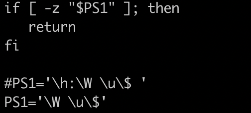

# MacOS系统使用

## 环境变量

- 环境变量配置文件位置 

```shell
$ open ~/.bash_profile
```

- Mac系统的环境变量，加载顺序为：

```shell
/etc/profile /etc/paths ~/.bash_profile ~/.bash_login ~/.profile ~/.bashrc
```

- 配置模板

```markdown
# Node 
export PATH=/usr/local/Cellar/node/10.7.0/bin:$PATH

# Mysql数据库
export PATH="/usr/local/sbin:/usr/local/mysql/bin:$PATH"  

# PHP拓展
export PATH="/usr/local/Cellar/php@5.6/5.6.36_1/bin:$PATH"
export PATH="/usr/local/Cellar/php@5.6/5.6.36_1/sbin:$PATH"
```


## NTFS移动设备

### 本机环境： 

macOS Sierra version 10.12.6 
2017 款 MacBook Pro 
2017.9.10

此方法对10.6以前版本的OS理论上是无效的 

**流程简介**

1. 挂载上你的NTFS硬盘，查看硬盘名称
2. 编辑/etc/fstab文件，使其支持NTFS写入
3. 将/Volumes中的NTFS磁盘快捷方式到Finder

**详细流程**

1. 插上硬盘后，查看你的硬盘名称，这里假设名称是AngleDisk，牢记之（你的可不是这个呀！！）
2. 打开Applications的Terminal, 你也可以直接spotlight输入terminal打开
3. 在终端输入`sudo nano /etc/fstab` 敲击回车
4. 现在你看到了一个编辑界面，输入`LABEL=AngleDisk none ntfs rw,auto,nobrowse`后，敲击回车，再Ctrl+X，再敲击Y，再敲击回车
5. 此时，退出你的移动硬盘，再重新插入，你会发现磁盘没有显示再桌面或是Finder之前出现的地方，别慌
6. 打开Finder，Command+Shift+G，输入框中输入`/Volumes`，回车，你就可以看到你的磁盘啦！是可以读写的哟，Enjoy
7. 方便起见，你可以直接把磁盘拖到Finder侧边栏中，这样下次使用就不用进入到/Volumes目录打开了

Enjoy !!

移动硬盘文件属性包含@拓展属性,不能直接使用 可使用下列命令

```shell
$ ls -l   #可以查看当前文件夹下所有文件属性,都带@拓展属性,不能直接使用.使用下一个命令解决(注意后缀) 
$ xattr -c *.png  #移除文件拓展属性`
```

**移除配置**

```shell
$ sudo rm /etc/fstab
```


## 文件隐藏/显示

```markdown
Command + Shift + .
```


## Hosts


## items计算机名字隐藏

- 在终端输入 sudo vim /etc/bashrc 命令

- 输入密码后会出现下图

- 如图修改, 将系统自带默认的配置用 # 注释, 同时换行 输入 PS1= '\W \u\$'后 , 按 wq! 强制保存, 退出终端即可看出效果





### Node安装路径

	Node.js v10.10.0 to /usr/local/bin/node
	npm v6.4.1 to /usr/local/bin/npm