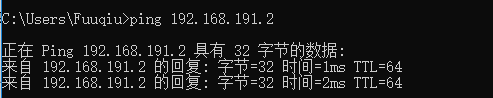

# Synergy鼠标共享方案


##### SEO:

​	关于两台电脑共用一套键鼠的解决方案,无缝切换没有延迟没有卡顿,使用软件当然是业界顶顶大名的Synergy了,该软件支持MacOS,Windows,linux系统,很符合我们日常使用


## 硬件搭配

因为我自己笔记本是Macbook Pro和一台公司的Windows 10台式机,笔记本屏幕小,台式机系统不喜欢用于开发,所以就需要两台电脑同时用于开发了.

### 注意事项:

- 在使用Synergy的时候发现,卡顿还是比较严重,场景是我的笔记本和台式机都是通过无线路由器上网,同一个无线路由器,那么自然也是在同一网段中,但是切换操作时卡顿的比较厉害
- 台式机上网是通过TP-link USB无线网卡上网,为了解决卡顿问题,我使用windows系统开热点,笔记本通过台式机热点联网,这样相对来说可以绕过路由器,实现内部组网.这样一来完美解决了切换卡顿问题


## 安装并配置Synergy

#### 安装

- 首先两台电脑都需要安装上Synergy
- 互相能够ping通,至于查看电脑IP这里就不详细介绍了

```Shell
$ ping 192.168.191.1
```


出现以上效果,那么说明ping通了windows主机,反向也是需要能够ping通的,单边并不能证明两台电脑是互通的




通过以上连个步骤,已经确认环境上是没有问题,进入配置


### 配置

- 配置服务端


#### 点击设置服务端


点击软件左上角工具条:**编辑**-**>设置**


端口号一定要和windows的保持一致,如果mac设置3309,那么windows主机也需要设置为3309.端口号尽量是4位数以上的,避免一些已经被占用的端口号,否则可能出现键鼠切换失败


- #### 配置客户端


这样配置就可以实现了键鼠共享了,这也是我第一次能够快速在macOS和windows中如此快速的切换,因为笔者的笔记本没有USB接口,每次都需要转接口,通过这次的配置,那么将计划把无线键鼠的的发射器安装在windows主机上,这样我的笔记本也能在不使用外键转接口的情况下使用无线键盘了.赞一个

哈哈现在已经切换过来了,windows作为作为服务器,笔记本作为客户端.转接头已经被我拔了扔掉了.使用过程中没有出现任何卡顿,这是我目前找到最好的解决方式了.有一种无线键盘变成官方的蓝牙键盘的感觉.Feel  Cool


*需要软件的可以邮件或者Github联系,其他联系方式可能会随着时间推移而失效*


