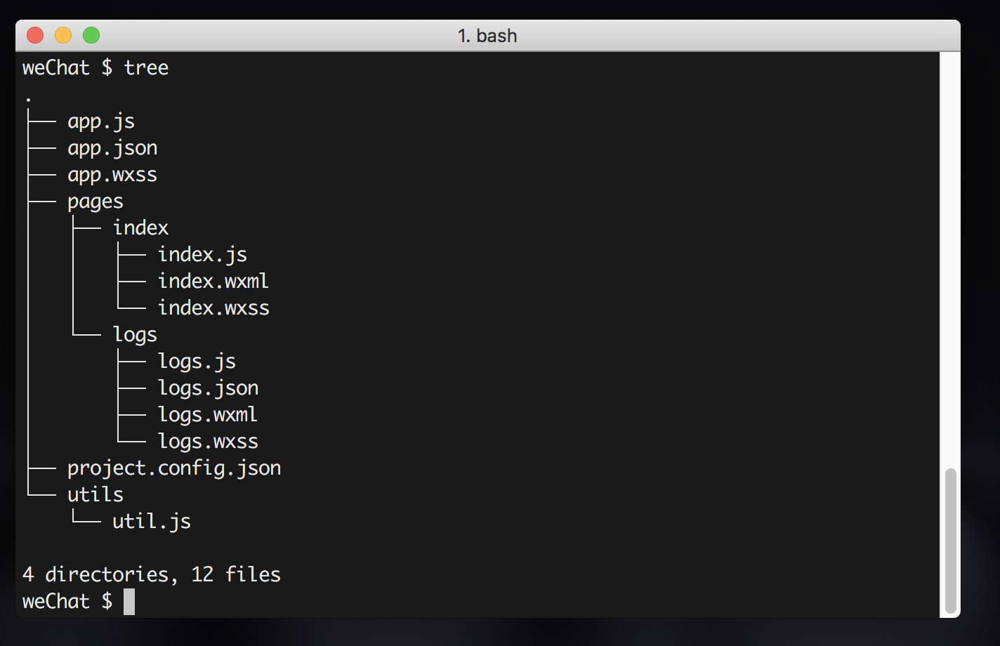
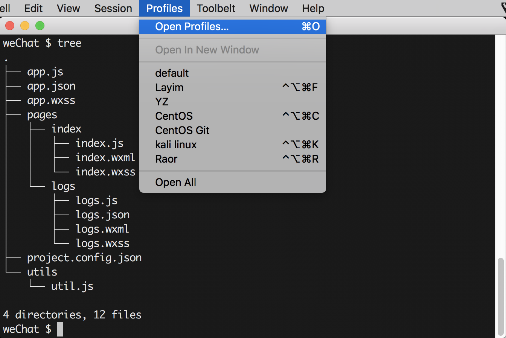
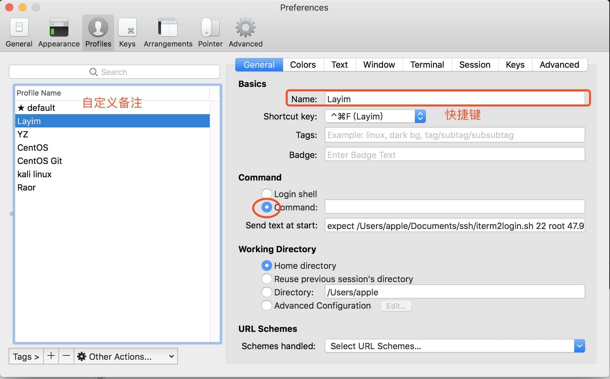

# iTerm2

## 简介

iTerm2终端模拟器macOS神器(原文:iTerm2 is a terminal emulator formacOS that does amazing things.)


## 界面




## SSH配置



- 打开配置文件



- 配置参数

```shell
expect /Users/apple/Documents/ssh/iterm2login.sh 22 root 47.47.47.47 password
```

- 新建配置文件

```
/Users/apple/Documents/ssh/iterm2login.sh #存放目录和文件名自定义,相对应即可
```

- 打开配置文件输入如下代码

```shell
#!/usr/bin/expect

set timeout 30
spawn ssh -p [lindex $argv 0] [lindex $argv 1]@[lindex $argv 2]
expect {
        "(yes/no)?"
        {send "yes\n";exp_continue}
        "password:"
        {send "[lindex $argv 3]\n"}
}
interact

```


## SSH上传文件和下载文件

```Shell
#安装 SSH(Secure Shell) 服务以提供远程管理服务 
$ sudo apt-get install ssh

#SSH 远程登入 Ubuntu 机 
$ ssh username@192.168.0.1

#将 文件/文件夹 从远程 Ubuntu 机拷至本地(scp) 
$ scp -r username@192.168.0.1:/home/username/remotefile.txt

#将 文件/文件夹 从本地拷至远程 Ubuntu 机(scp) 
$ scp -r localfile.txt username@192.168.0.1:/home/username/

#将 文件/文件夹 从远程 Ubuntu 机拷至本地(rsync)

$ rsync -v -u -a --delete --rsh=ssh --stats sername@192.168.0.1:/home/username/remotefile.txt

#将 文件/文件夹 从本地拷至远程 Ubuntu 机(rsync)
$ rsync -v -u -a --delete --rsh=ssh --stats localfile.txt username@192.168.0.1:/home/username/

```


## 拷贝文件到本机

```shell
scp -r root@39.108.163.60:/etc/nginx /Users/apple/Desktop/serve
```

