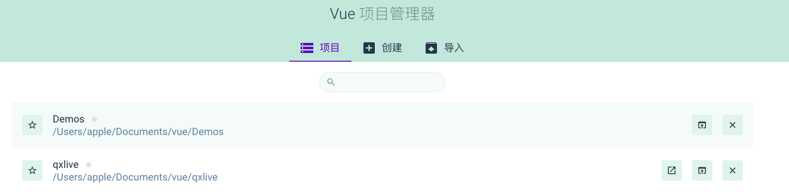
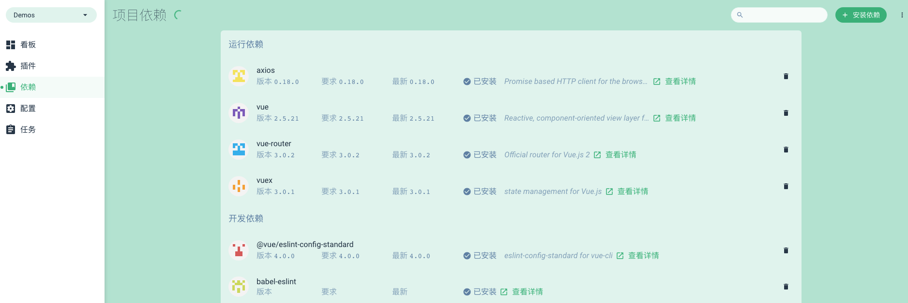
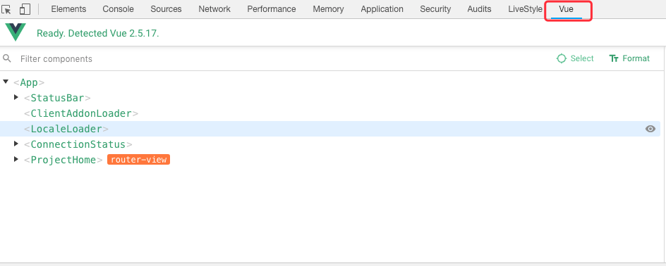

# Vue-Cli

## 前言

  一个项目的技术选型和整个团队的技术栈对项目有着至关重要的影响,就好比''兵马未动粮草先行'',IT技术日益更新永远使用的都是昨日的新,今日的旧.一个团队看的有多远,走的就有多远


Vue项目自2018年如火如荼,相应的三方包由如雨后春笋般拔地而起,一时风靡.随着开发者参与的越来越多,问题也渐出水面,各种三方也是不断迭代.


## @Vue-Cli和Vue-Cli区别

  随者vue的发展,@Vue-Cli进入了视野,提供了GUI维护界面,相对侧重于后端和浅尝Vue的小伙伴来说,是一个利好的升级.手工升级Vue-Cli项目为@Vue-Cli项目研究一点时间,最终没有实现,平时对于前端框架也仅限于使用,手工升级失败也是正常不过,如果刚进行或者项目时间比较充裕,建议直接使用@Vue-Cli创建项目,进行开发会是一个不错的选择


## @Vue-Cli GUI介绍

- 启动@Vue-Cli Gui

  ```shell
  $ vue -V
    3.2.1  #查看Vue-Cli版本
  $ vue ui
    Ready on http://localhost:8000 #复制到浏览器即可打开
  ```

   

- 首页




- 项目依赖 清晰明了亦可直接在界面安装依赖




## Chrome Vue Tools 调试工具

- Google浏览器插件市场安装

- 打开运行Vue项目并打开浏览器开发者控制台

  


## 谨言

  笔者也不过是一个初出茅庐的小子,喜书写微薄经验和见解分享,描述或有不当请友善提示,必当尽快修复.

闲聊几句:对于开发者来说,官网永远是最完整,查阅文献最有效的地方,要尽快脱离三方文献的翻译或带有个人意志的分享文献,开发环境尽量搭建完善并记录以便换开发环境能够快速找到那种感觉.三方文献譬如此篇仅作为个人观点,实在不宜宣众而食,取文中之精华,亦可离去

 

如果对于本人系列文献感兴趣,可以参与到其中来编写和修正,采用Github管理,亦可下载独立撰写


