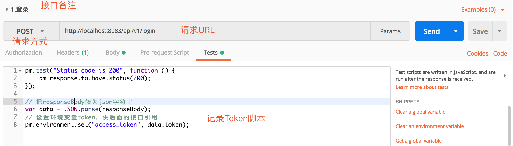
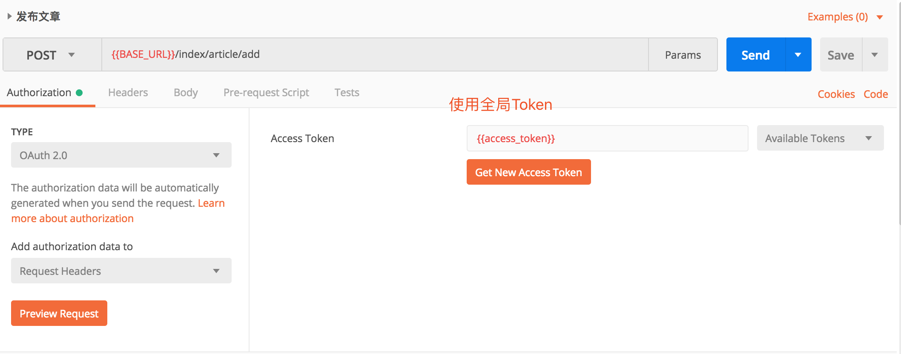
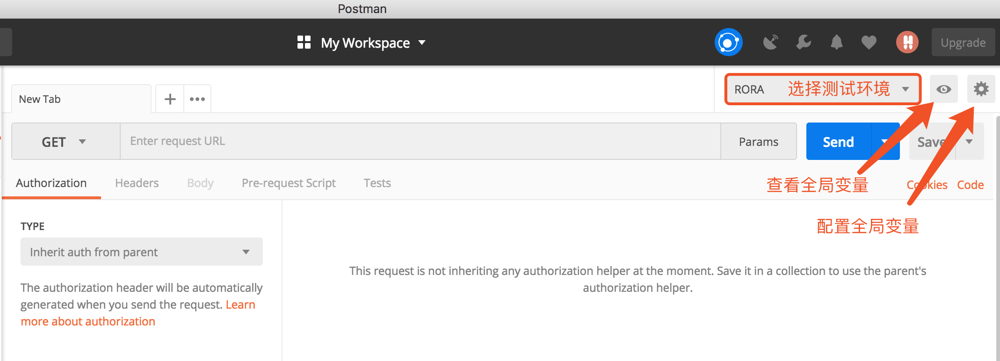

# PostMan接口调试工具

```
最近因为写接口比较多,也是刚换到现在的组合软件记录笔记.会有很多变动,样式和记录风格又做了一小部分的调整
目前笔记编写只有本人参与,希望后期有更多的小伙伴参与其中
```


接口呈现使用Swagger来编写,因为也是刚开始接触,使用不是很熟练,基本上是在Postman中调试成功,才会在Swagger中编写Open API ,在这里感谢Kevin大神的指导,让我接触到了更广阔的世界中

## 免登陆调试

### Token存储到全局变量

通常很多请求接口都是私密的,每次请求都需要携带token,而每次登录token都会改变,为了避免每次请求都需要手工携带token,就需要在登陆的时候将token存储在全局变量中



通过以上方式,可以将token存储到全局变量中.变量名:access_token

### 使用全局变量中的Token




## 快速切换调试环境

在开发中我们通常会遇到开发环境,测试环境,正式环境…,如果每一个接口都去修改请求路径也是一件费神的事

### 手工配置全局变量



### 配置示例


说明:使用变量语法 {{var_name}}