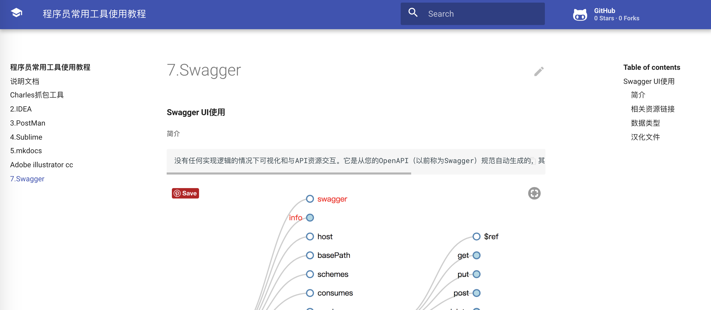

# mkdocs工具使用

## 简介


## 主题

#### 预览图



1.安装主题

```shell
$ pip install mkdocs-material
```

2.mkdocs.yml文件修改主题

```css
theme: material
```


## CentOS环境

#### 安装

```shell
$ pip install mkdocs
12
```

#### 查看 mkdocs 版本

```sh
$ mkdocs -V
mkdocs, version 0.16.3
```

#### 创建项目

```Shell
$ mkdocs new demo #创建了一个demo项目
```

##### 项目结构


#### 运行项目

```Shell
$ mkdocs serve --dev-addr=10.211.55.3:8230 #浏览器访问：10.211.55.3:8230
# mkdocs serve --dev-addr=127.0.0.1:8088
```

#### 生成项目

```shell
$ mkdocs build #生成html文档位于site文件夹下
```


#### 升级

```Shell
$ pip install -U mkdocs
12
```

#### 卸载

```Shell
$ pip uninstall mkdocs
```