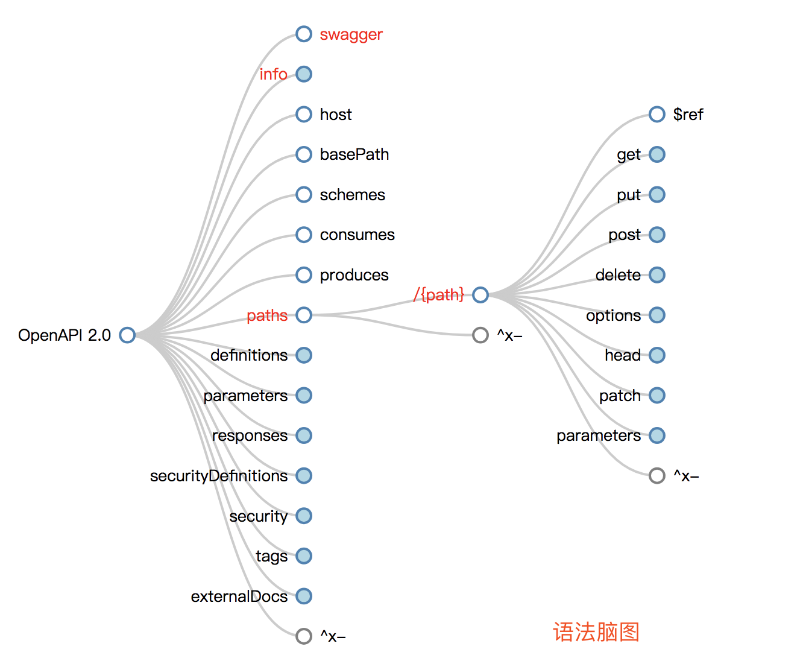

#### Swagger UI使用


##### 简介

```
没有任何实现逻辑的情况下可视化和与API资源交互。它是从您的OpenAPI（以前称为Swagger）规范自动生成的，其可视化文档使后端实现和客户端消费变得容易。--来源官方翻译
```



- **理解：**
  - 不论是什么工具，需要对其背景和相关资源都要有所涉猎。便于更好的掌握
  - Swagger是一个Restful风格接口的文档在线自动生成和测试的框架。语法遵从yaml，语法参[考阮一峰](http://www.ruanyifeng.com/blog/2016/07/yaml.html?f=tt)
  - 在编写之前很有必要认真阅读[Restful规范](https://www.vinaysahni.com/best-practices-for-a-pragmatic-restful-api)

##### 相关资源链接

- [在线编辑器](https://editor.swagger.io/)
- [参数示例](https://swagger.io/docs/specification/describing-parameters/)
- [语法节点脑图](http://openapi-map.apihandyman.io/?version=2.0)
- [详细语法文档](https://swagger.io/specification/)

 更多使用教程后续会持续更新，参考以上语法可快速编写swagger文档

##### 数据类型

| 通用名称 | [类型](https://swagger.io/specification/#dataTypes) | [格式](https://swagger.io/specification/#dataTypeFormat) | 注释                                                         |
| -------- | --------------------------------------------------- | -------------------------------------------------------- | ------------------------------------------------------------ |
| 整数     | integer                                             | int32                                                    | 签名32位                                                     |
| 长       | integer                                             | int64                                                    | 签名64位                                                     |
| 浮动     | number                                              | float                                                    |                                                              |
| 双       | number                                              | double                                                   |                                                              |
| 串       | string                                              |                                                          |                                                              |
| 字节     | string                                              | byte                                                     | base64编码的字符                                             |
| 二进制   | string                                              | binary                                                   | 任何八位组序列                                               |
| 布尔     | boolean                                             |                                                          |                                                              |
| 日期     | string                                              | date                                                     | 由full-date- [RFC3339](https://xml2rfc.ietf.org/public/rfc/html/rfc3339.html#anchor14)定义 |
| 约会时间 | string                                              | date-time                                                | 由date-time- [RFC3339](https://xml2rfc.ietf.org/public/rfc/html/rfc3339.html#anchor14)定义 |
| 密码     | string                                              | password                                                 | UI提示隐藏输入。                                             |

##### HTTP状态代码

HTTP定义了一堆可以从API返回的[有意义的状态代码](http://en.wikipedia.org/wiki/List_of_HTTP_status_codes)。可以利用这些来帮助API消费者相应地路由他们的响应。我已经策划了一份你肯定应该使用的短名单：

- 200 OK - 响应成功的GET，PUT，PATCH或DELETE。也可以用于不会导致创建的POST。
- 201 Created - 对POST的响应，导致创建。应与指向新资源位置的[Location标头](http://www.w3.org/Protocols/rfc2616/rfc2616-sec14.html#sec14.30)结合使用
- 204 No Content - 对不会返回正文的成功请求的响应（如DELETE请求）
- 304 Not Modified - 在HTTP缓存标头播放时使用
- 400错误请求 - 请求格式错误，例如正文无法解析
- 401 Unauthorized - 未提供或无效的身份验证详细信息时。如果从浏览器使用API，也可以触发auth弹出窗口
- 403 Forbidden - 身份验证成功但经过身份验证的用户无权访问资源
- 404 Not Found - 请求不存在的资源时
- 405不允许的方法 - 当请求的HTTP方法不允许经过身份验证的用户时
- 410 Gone - 表示此端点的资源不再可用。对旧API版本的一揽子响应很有用
- 415不支持的媒体类型 - 如果作为请求的一部分提供了错误的内容类型
- 422不可处理的实体 - 用于验证错误
- 429请求过多 - 请求因速率限制而被拒绝


##### 汉化文件

```
"Warning: Deprecated": "警告：已过时",
"Implementation Notes": "实现备注",
"Response Class": "响应类",
"Status": "状态",
"Parameters": "参数",
"Parameter": "参数",
"Value": "值",
"Description": "描述",
"Parameter Type": "参数类型",
"Data Type": "数据类型",
"Response Messages": "响应消息",
"HTTP Status Code": "HTTP状态码",
"Reason": "原因",
"Response Model": "响应模型",
"Request URL": "请求URL",
"Response Body": "响应体",
"Response Code": "响应码",
"Response Headers": "响应头",
"Hide Response": "隐藏响应",
"Headers": "头",
"Try it out!": "试一下！",
"Show/Hide": "显示/隐藏",
"List Operations": "显示操作",
"Expand Operations": "展开操作",
"Raw": "原始",
"can't parse JSON.  Raw result": "无法解析JSON. 原始结果",
"Model Schema": "模型架构",
"Model": "模型",
"apply": "应用",
"Username": "用户名",
"Password": "密码",
"Terms of service": "服务条款",
"Created by": "创建者",
"See more at": "查看更多：",
"Contact the developer": "联系开发者",
"api version": "api版本",
"Response Content Type": "响应Content Type",
"fetching resource": "正在获取资源",
"fetching resource list": "正在获取资源列表",
"Explore": "浏览",
"Show Swagger Petstore Example Apis": "显示 Swagger Petstore 示例 Apis",
"Can't read from server.  It may not have the appropriate access-control-origin settings.": "无法从服务器读取。可能没有正确设置access-control-origin。",
"Please specify the protocol for": "请指定协议：",
"Can't read swagger JSON from": "无法读取swagger JSON于",
"Finished Loading Resource Information. Rendering Swagger UI": "已加载资源信息。正在渲染Swagger UI",
"Unable to read api": "无法读取api",
"from path": "从路径",
"server returned": "服务器返回"
```

