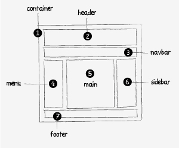

# AdobePhotoshop

## 1.常用快捷键

1. 新建图形文件Ctrl+N键
2. 新建图层Ctrl+Shift+N键
3. 后退一步Ctrl+Alt+Z键
4. 图像放大缩小【缩小】按住z键左滑鼠标【放大】按住z键右滑鼠标
5. 自由变换Ctrl+T
6. 取消选区Ctrl+D
7. 通过拷贝建立一个图层（无对话框）Ctrl+J
8. 创建/释放剪贴蒙版ctrl+Alt+G
9. 临时使用抓手工具空格+鼠标左键
10. 临时使用移动工具Ctrl+鼠标左键
11. 变换前景后景色X键
12. 改变当前工作区背景色：空格+F
13. 更改屏幕显示模式：F
14. 工作区窗口显示/隐藏：Tab
15. 新建图层：Ctrl+Shift+Alt+N
16. 盖印图层：Ctrl+Shift+Alt+E
17. 选中所有图层：Ctrl+Alt+A
18. 选中图层合并成组：Ctrl+G
19. 切换图层显示状态：Ctrl+,
20. 选中背景：Alt+,
21. 显示标尺：Ctrl+R
22. 复位颜色(前白后黑)：D
23. 颜色切换:X
24. 填充背景色：Ctrl+Delete
25. 填充前景色：Alt+Delete

### 1. Shift快捷键

1. 按Shift时可画出正圆和方形的选区、图形、直线。
2. 按Shift时可画出垂直、水平和45度的直线
3. 按Shitf时可用鼠标垂直、水平和45度的移动对象
4. 按Shift时可快速的移动对象
5. 按Shift+“选区工具”可增加选区，Alt+“选区工具”可减少选区
6. 按Shift+Alt时可画出以某点为中心的正圆和正方形。
7. Shift+“Backspace”调出填充对话框

### 2. 图层透明度调节

横排1~9调节当前图层透明度，1表示透明度10%

## 2. 图层整理技术的优点

1. 提高团队协作能力
2. 快速找到相关图层
3. 文件更专业

## 3. 图层分组方法

#### 1. 前端图层命名示范：

#### 2. 常用命名汇总:

页头:header

登录条:loginbar

标志:logo

侧栏:sidebar

广告条:banner

导航:nav

子导航:subNav

菜单:menu

子菜单:subMenu

下拉菜单:dropMenu

工具条: toolbar

表单:form

栏目:column

箭头:arrow

搜索:search

搜索按钮:btn-search

滚动条:scroll

内容:content

标签页:tab

文章列表:list

提示信息:msg

小技巧:tips

栏目标题:title

链接:links

页脚:footer

服务:service

热点:hot

新闻:news

下载:download

注册:regsiter

状态:status

按钮:btn

投票:vote

合作伙伴:partner

版权:copyright

网站地图: sitemap

